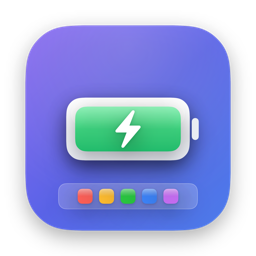
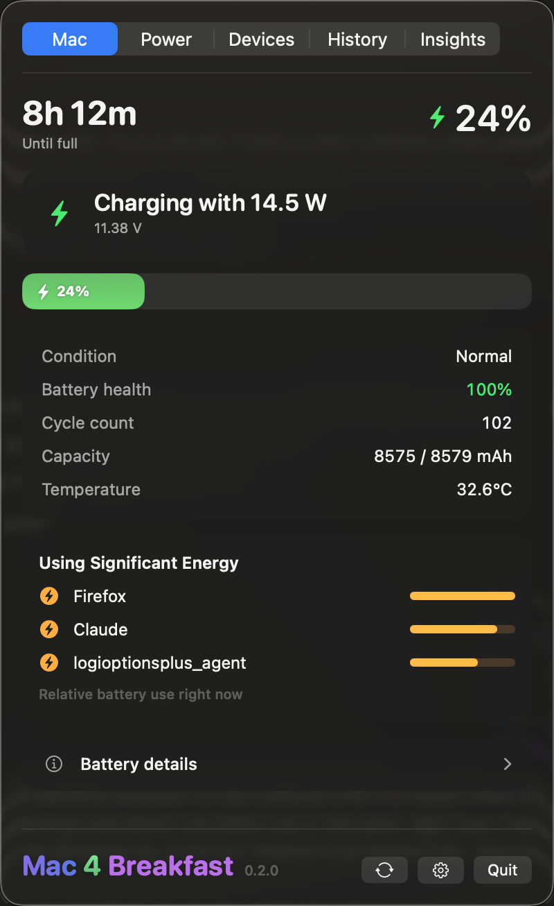
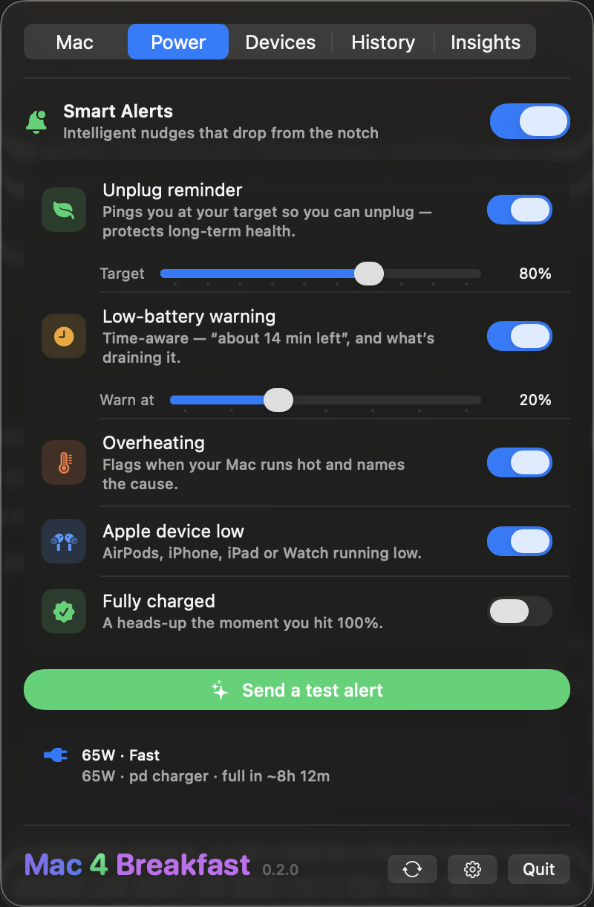
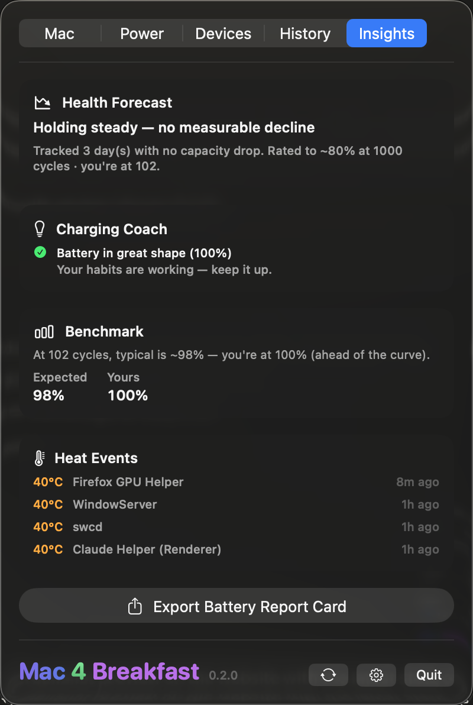

# Mac 4 Breakfast

**The all-in-one Mac battery & power-health app — health, live watts, every Apple device, and Smart Alerts, in one menu-bar icon.**

A native macOS menu-bar app that surfaces what macOS hides: true battery **health**, **cycle count**, **temperature**, live charging **wattage**, and the **time-remaining** estimate Apple removed in 2016. 100% local, no account, one-time price.

**[⬇️ Download for macOS](https://www.mac4breakfast.app) · [🌐 Website](https://www.mac4breakfast.app) · [🐞 Report a bug / request a feature](https://github.com/onekapisch/Mac-4-Breakfast/issues/new/choose)**

> [!NOTE]
> **Mac 4 Breakfast is a commercial, closed-source app.** This repository hosts its **documentation, changelog, and issue tracker** — not the source code. Bug reports and feature requests are very welcome → [open an issue](https://github.com/onekapisch/Mac-4-Breakfast/issues/new/choose).

## Why

macOS knows everything about your battery — and shows you almost none of it. The menu bar gives you a percentage; Settings gives you a vague "Normal" or "Service Recommended." No cycle count, no real capacity, no temperature, no live wattage — and the **time-remaining estimate Apple removed in 2016** never came back.

So people end up running three apps — one for health (coconutBattery), one for charge habits (AlDente), one menu-bar monitor — each with its own window, price, and footprint. Mac 4 Breakfast puts all of it behind **one menu-bar icon** that stays out of the way until you glance at it.

## What you get

- 🔋 **Real battery health** — exact maximum capacity, cycle count, condition, and design-vs-current mAh, not a vague label.
- ⏱️ **True time remaining** — the live "3h 42m left" / "1h 8m to full" estimate Apple dropped, back in your menu bar.
- ⚡ **Live power flow** — real-time wattage and voltage the moment you plug in, so you can tell if a charger or cable is actually fast.
- 🌡️ **Temperature, done right** — battery-cell temperature with a configurable overheating threshold, so it warns you when it's *actually* hot — not at normal warmth.
- 🔔 **Smart Alerts from the notch** — an unplug reminder at your charge target, a predictive low-battery warning that names the heaviest app, and overheating alerts that name the cause.
- 📱 **Every Apple device** — iPhone, iPad, AirPods, Apple Watch and Magic accessories, their batteries in one place (USB, Wi-Fi, Bluetooth).
- 🎛️ **The most customizable menu bar** — show any two of percentage, time, watts, temperature or health, or a Smart adaptive mode; °C or °F; gauge or glyph.
- 📊 **Insights nobody else shows** — a shareable Battery Report Card, a lifetime analyzer, a heat-event log, and a live "what's using significant energy right now."

&nbsp;&nbsp;

## How it compares

An honest look at where each app focuses. All three alternatives are good at what they do — Mac 4 Breakfast's angle is doing the whole job in one place, locally, for a one-time price. This is also a quick reference if you're looking for a **coconutBattery alternative**, an **AlDente alternative**, or an **iStat Menus alternative**.

| | **Mac 4 Breakfast** | coconutBattery | AlDente | iStat Menus |
|---|:---:|:---:|:---:|:---:|
| Battery health & cycle count | ✅ | ✅ | — | ✅ |
| Live wattage & voltage | ✅ | ✅ | — | ✅ |
| True time-remaining estimate | ✅ | — | — | ✅ |
| Notch Smart Alerts (unplug / low / heat) | ✅ | — | — | — |
| iPhone / iPad / AirPods / Watch batteries | ✅ | iOS only* | — | — |
| Hardware charge limiting (cap at 80%) | reminder, not a cap | — | ✅ | — |
| Full system monitor (CPU / net / sensors) | battery-focused | — | — | ✅ |
| 100% local · no account · no telemetry | ✅ | ✅ | ✅ | ✅ |
| Price | **$4.99 one-time** + free tier | free / paid | free / Pro one-time | one-time (higher) |

\* coconutBattery reads a connected iOS device; Mac 4 Breakfast also covers AirPods, Apple Watch and Magic accessories. AlDente does true hardware charge-limiting via a background helper; Mac 4 Breakfast deliberately ships **no** privileged helper and instead reminds you to unplug at your target. Comparison reflects each app in mid-2026 — spot something out of date? [Open an issue](https://github.com/onekapisch/Mac-4-Breakfast/issues/new/choose).

## Privacy & security

Everything stays on your Mac. **No account, no telemetry, no analytics SDK** — the app makes no network calls except a one-time license activation and the Sparkle update check. It reads battery data through Apple's own IOKit / SMC APIs. Full data-flow and how to report a vulnerability: **[SECURITY.md](SECURITY.md)**.

## Install

**Requirements:** macOS 14 (Sonoma) or later · Apple silicon or Intel.

1. **[Download Mac 4 Breakfast](https://www.mac4breakfast.app)** — a notarized `.pkg` installer.
2. Open the `.pkg` and follow the installer; it places the app in **Applications**. It's notarized by Apple, so there's no "unidentified developer" warning.
3. Launch **Mac 4 Breakfast** from Applications — it lives in your menu bar.

**Update:** the app updates itself automatically (Sparkle), or re-download the latest from the website any time.

**Uninstall:** quit the app (menu-bar icon → **Quit**), then drag **Mac 4 Breakfast** from Applications to the Trash.

## Roadmap & feedback

Development is active and shaped by users — the overheating-alert overhaul in 0.2.3 came straight from a user pointing out that 35 °C isn't "hot." Got an idea or a bug?

- 🐞 **[Report a bug](https://github.com/onekapisch/Mac-4-Breakfast/issues/new?template=bug_report.yml)**
- ✨ **[Request a feature](https://github.com/onekapisch/Mac-4-Breakfast/issues/new?template=feature_request.yml)**
- 📓 **[Changelog](CHANGELOG.md)**

## FAQ

**Is it open source?**
No — Mac 4 Breakfast is a commercial, closed-source app. This repo is its public docs, changelog and issue tracker, so the history and feedback are in the open even though the code isn't.

**Why pay when coconutBattery is free?**
coconutBattery (free) is great for an occasional deep health check — but you have to open it, and it has no Smart Alerts, no customizable menu bar, and no "what's draining it" view. Mac 4 Breakfast is the always-there, glanceable layer with alerts and insights, for a one-time $4.99 (the free tier covers the basics). Different job — not a knock on a good tool.

**Why isn't it on the Mac App Store?**
The App Store sandbox blocks the low-level IOKit/SMC access needed for cycle count, temperature and live wattage, so it's a direct, Apple-notarized download instead.

**Does it cap charging at 80% like AlDente?**
Not as a hardware cap — that needs a privileged background helper we deliberately don't ship. Instead it gives you an **unplug reminder** when you reach your target.

---

**If Mac 4 Breakfast saves your battery some wear, [⭐ star the repo](https://github.com/onekapisch/Mac-4-Breakfast) — it genuinely helps.**

[Download](https://www.mac4breakfast.app) · [Website](https://www.mac4breakfast.app) · [Changelog](CHANGELOG.md) · [Security](SECURITY.md) · [Issues](https://github.com/onekapisch/Mac-4-Breakfast/issues)

